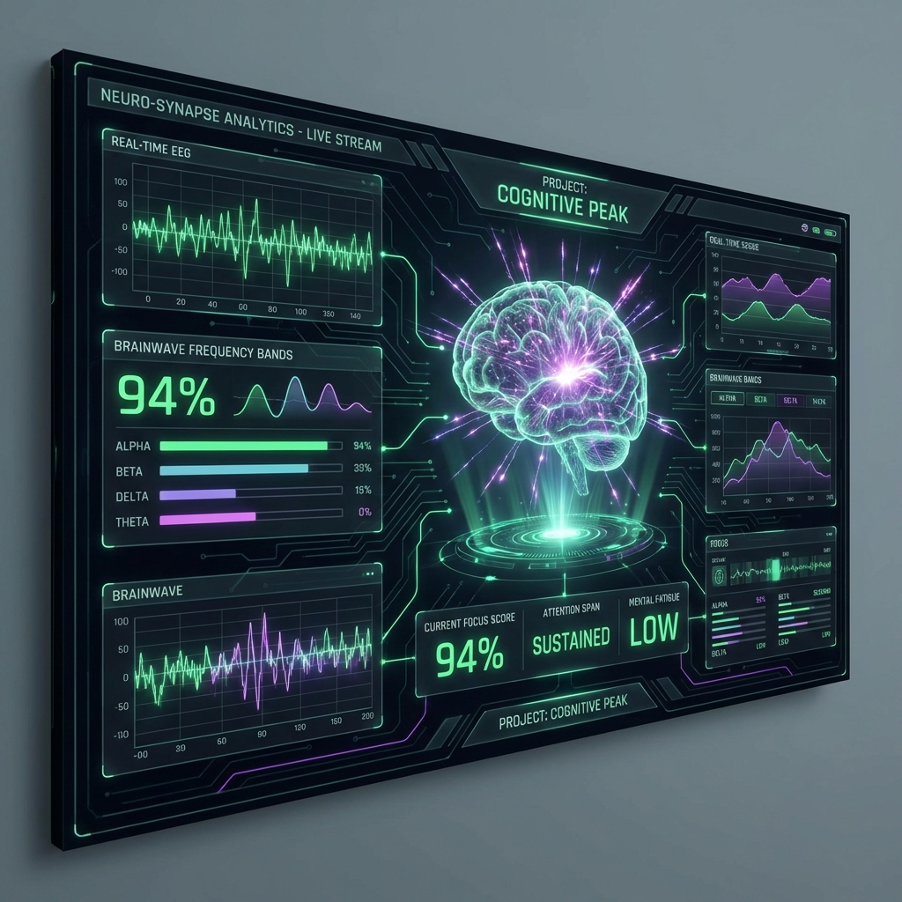

# 🧠 FocusAI (Real-Time Concentration Tracker)

##  Overview
**FocusAI** is a sophisticated computer vision system designed to analyze and improve user productivity in real-time. By leveraging **Deep Learning** models for gaze tracking and facial landmark detection, it provides granular insights into attention spans.

##  Key Features
*   ** Gaze & Head Pose Estimation**: Uses advanced geometric algorithms.
*   ** Real-Time Distraction Alerts**: Gentle notifications when focus drifts.
*   **📊 Productivity Dashboard**: React-based frontend visualizing focus trends.
*   **🔒 Privacy First**: All video processing happens locally.

## � Tech Stack
*   **AI Engine**: TensorFlow / MediaPipe Face Mesh
*   **Processing**: Python (OpenCV)
*   **Frontend**: React.js, Chart.js

## 📦 Installation
\\\ash
git clone https://github.com/om051105/Real-Time-Concentration-Tracker.git
cd Real-Time-Concentration-Tracker
pip install -r backend/requirements.txt
python backend/app.py
\\\
"@

 = @"
# 👁️ Sudoku Vision - AR Solver

  
  

## 📌 Overview
**Sudoku Vision** is a cutting-edge Augmented Reality (AR) application that solves Sudoku puzzles in real-time. Simply point your camera at a physical Sudoku puzzle.

## 🚀 Key Features
*   📷 **Real-Time Detection**: Robust grid extraction.
*   🤖 **Intelligent OCR**: High-accuracy digit classification.
*   ⚡ **Instant Solving**: Millisecond-level performance.

## 🛠️ Tech Stack
*   **Frontend**: React.js
*   **Computer Vision**: OpenCV
*   **Algorithm**: Recursive Backtracking